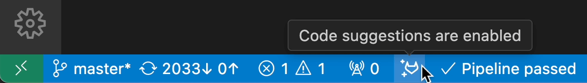
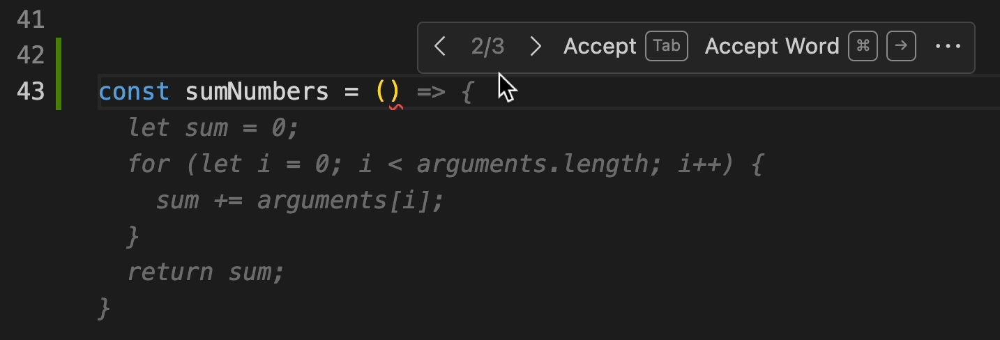

<figure align="center">
    

        
GitLab Duo Code Suggestions

        
        <figcaption>At the bottom of VS Code, in the status bar, confirm GitLab Duo Code Suggestions is enabled and your file's language is supported. To enable unsupported languages, add the <a href="https://code.visualstudio.com/docs/languages/identifiers#_known-language-identifiers">language identifier</a> to the extension's <a href="https://gitlab.com/gitlab-org/gitlab-vscode-extension#extension-settings
">additional language list</a> in settings.</figcaption>
    

</figure>
<figure align="center">
    

        
GitLab Duo Code Suggestions

        
        <figcaption>Autocomplete suggestions appear as you write code. Hover to see alternatives.</figcaption>
    

</figure>
